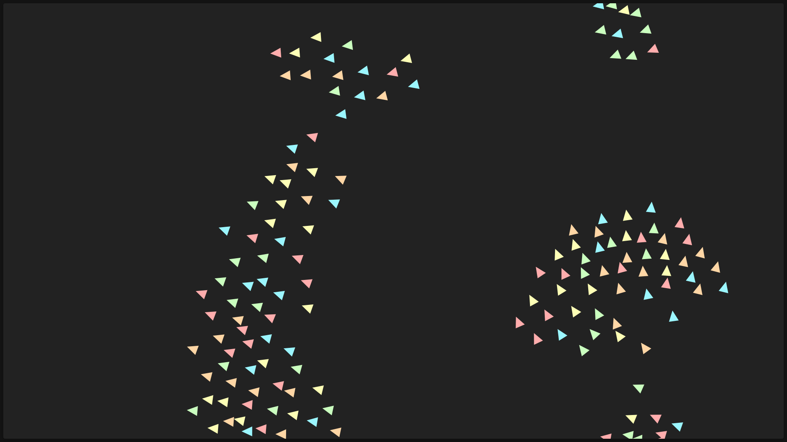

# Boids Simulation

A simple implementation of Craig Reynolds' **Boids** algorithm using **TypeScript** and the **HTML5 Canvas API**. The simulation demonstrates how complex flocking behavior emerges from a few simple local rules.

## How it works

Each bird only reacts to the birds within its vision range. There is no leader or central controller. Every frame, a bird adjusts its movement using three simple behaviors:

* **Alignment**: Steer in the average direction of nearby birds.
* **Cohesion**: Move toward the center of nearby birds to stay with the flock.
* **Separation**: Keep a comfortable distance to avoid collisions.

By combining these three rules, the flock naturally forms realistic patterns and movements.

## Features

* Built from scratch using TypeScript and Canvas
* Smooth real-time flocking simulation
* Configurable bird behaviors and vision ranges
* Simple, lightweight, and easy to experiment with
